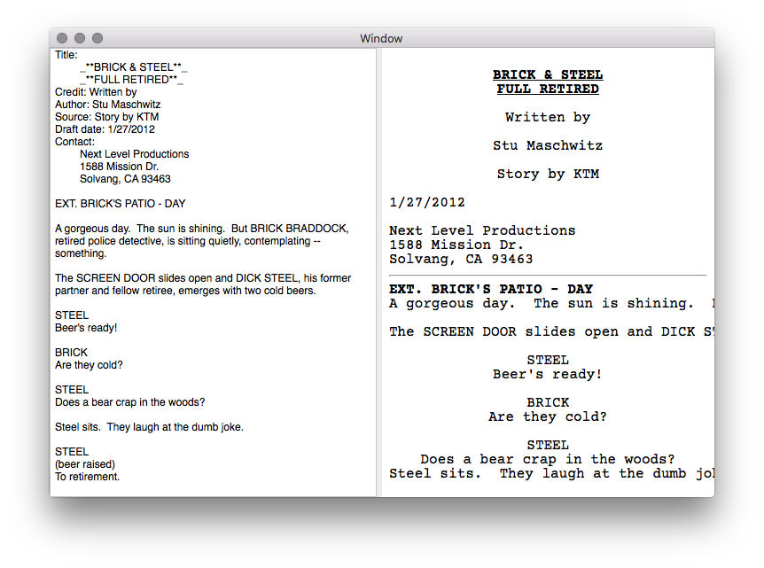

# FountainSharp

[](https://www.bitrise.io/app/45c89db89673e862)

An F# based [Fountain Markdown](http://fountain.io) processor for use via .NET/Xamarin projects. FoutainSharp parses Fountain-formatted scripts and loads them into model that can be transformed or used for WYSIWYG editing. 

It ships with a sample transformation engine that transforms Fountain markdown into HTML:



FountainSharp fully supports the entirety of the Fountain syntax and includes unit tests for all elements.

## Consuming FountainSharp

FountainSharp is published as a NuGet package and can be added from the **Package Manager Console**:

```
Install-Package FountainSharp -Pre
```

## Usage

FountainSharp can operate on an entire script, or just a portion and expects a string as an input and will output an in-memory representation as a `FountainDocument`. A convenience method that takes a Fountain-formatted string and outputs an HTML string is also provided.

### Parsing a Script

To parse an entire script, simply call `Fountain.Parse` and pass a string:

```CSharp
var fountainDoc = FountainSharp.Parse.Fountain.Parse(script);

```

You can also just parse a snippet, which can be useful if you're writing an editor and only want to process changes:

```CSharp
var fountainDoc = FountainSharp.Parse.Fountain.Parse(script, (TODO));

```

You can also transform text straight to HTML. For example, the following code from the `TestProjects/Fountainsharp.Editor` project reads a file in and then updates a WebView with the html output:

```CSharp

var scriptResource = "FountainSharp.Editor.Scripts.SimpleTest.fountain";
string script;

using (var stream = Resource.FromPath (scriptResource)) {
	if (stream != null) {
		using (var reader = new System.IO.StreamReader (stream)) {
			script = reader.ReadToEnd ();

			this.MainTextView.Value = script;
			this.UpdateHtml ();

		}
	} else {
		Console.WriteLine ("Couldn't load " + scriptResource);
	}

}

protected async void UpdateHtml ()
{
	await System.Threading.Tasks.Task.Run (() => {
		
		InvokeOnMainThread (()=>{
			this.MainWebView.MainFrame.LoadHtmlString (FountainSharp.Parse.Fountain.TransformHtml (this.MainTextView.Value), NSUrl.FromString (""));
		});
	});
}
```

### Understanding a FountainDocument

A `FountainDocument` is an in-memory representation of a parsed fountain document and is represented as a `List<FountainBlockElement>`.  A block represents a (possibly) multi-line element of a fountain document. Blocks include:

  * Action
  * Character
  * Dialogue
  * Parenthetical
  * Section
  * Synopses
  * Lyrics
  * SceneHeading
  * PageBreak
  * Transition
  * Centered
  * Boneyard
  * DualDialogue
  * TitlePage
  
Most blocks contain a `List<FountainSpanElement>` which represent inline formatting inside a block. This can be literal (with text), various formattings such as:

  * Literal
  * Bold
  * Italic
  * Underline
  * Note
  * HardLineBreak
  
Note that many `FountainSpanElement` objects can actually contain span elements.  

## TODO

This project is a work in progress. For a detailed list of outstanding tasks, see the [TODO](Source/FountainSharp/FountainSharp.Parse/ToDo.md), however, in general the following major items are outstanding:

 * **Custom HTML CSS** - HTML transformation is largely done, but custom CSS templates should be allowed.
 

## Contributing

For contributing, please see the [Source Documentation](Source/FountainSharp.Parse/Documentation.md). I <3 well documented pull requests. :)

## License

FountainSharp is made available via the [MIT License](License.md). 


## People

FountainSharp is based on the [FSharp.Formatting library](https://github.com/tpetricek/FSharp.Formatting) by Tomas Petricek.

**Author**

[Bryan Costanich](https://twitter.com/bryancostanich)


**Contributors**

Gabor Nemeth

**Thanks**

Special thanks to [Frank Krueger](https://twitter.com/praeclarum) for tirelessly answering my F# questions.
